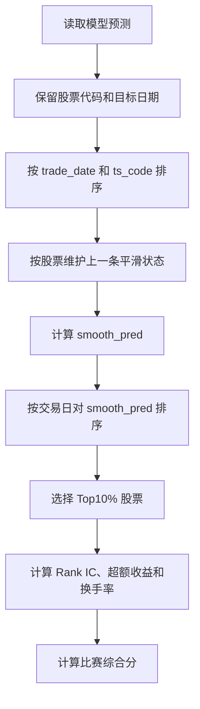

# 时间平滑降低换手率技术方案

## 1. 技术目标

在 LST-Transformer 已经生成股票预测分数的基础上，引入只使用当天和过去信息的时间平滑处理，降低相邻交易日 Top10% 股票组合的变化程度。

本方案属于预测结果后处理方案，模型结构和训练损失保持不变。最终使用比赛综合分评价：

```text
综合分
= 日度 Rank IC 均值 × 0.4
+ Top10% 年化超额收益 × 0.3
+ (1 - 平均换手率) × 0.3
```

## 2. 设计原则

### 2.1 时间顺序原则

预测结果必须按交易日从早到晚处理。当天的平滑分数只能使用：

- 当天原始预测值；
- 该股票之前交易日的平滑分数。

不得使用未来交易日的预测值、未来收益或未来持仓集合。

### 2.2 股票独立原则

每只股票单独维护上一交易日的平滑状态。股票 A 的历史预测不能参与股票 B 的平滑计算。

### 2.3 评价一致原则

原始预测和平滑预测必须使用相同的：

- 股票样本；
- 交易日期范围；
- 涨停过滤规则；
- Top10% 组合规则；
- 换手率计算方式；
- 综合分公式。

### 2.4 留出集隔离原则

平滑参数只在验证集上选择。本地留出集只在模型周期和平滑参数全部固定后进行最终核验。

## 3. 输入和输出

### 3.1 输入数据

每条预测记录至少包含：

```text
ts_code
trade_date
pred
y_ret_1d
limit_up
```

字段含义：

- `ts_code`：股票代码；
- `trade_date`：目标交易日；
- `pred`：模型原始预测分数；
- `y_ret_1d`：下一交易日真实收益；
- `limit_up`：涨停标记，仅用于评价过滤。

验证集的涨停字段来自：

```text
模型预处理/步骤5_标准化处理/验证集_标准化.parquet
```

验证集序列索引来自：

```text
模型预处理/步骤6_序列构造/序列索引_validation.parquet
```

通过 `source_row_index` 建立预测记录和 `limit_up` 的对应关系。

### 3.2 输出数据

增加以下字段：

```text
smooth_pred
smoothing_alpha
previous_smooth_pred
```

其中：

- `smooth_pred`：平滑后的预测分数；
- `smoothing_alpha`：使用的平滑参数；
- `previous_smooth_pred`：该股票上一条可用记录的平滑分数。

## 4. 平滑算法

### 4.1 指数时间平滑

对每只股票按日期排序，使用：

```text
s_t = α × p_t + (1 - α) × s_(t-1)
```

其中：

- `p_t` 是当前交易日原始预测值；
- `s_t` 是当前交易日平滑预测值；
- `s_(t-1)` 是该股票上一条可用记录的平滑预测值；
- `α` 是当天预测值权重。

### 4.2 首次出现的股票

某只股票在数据分区内第一次出现时，没有历史平滑值，使用：

```text
s_t = p_t
```

这适用于新上市股票、分区开始时的股票以及缺少历史预测状态的股票。

### 4.3 日期间断处理

如果股票在连续交易日之间缺少记录，使用该股票上一条可用预测记录作为历史状态。每条记录仍然按照真实交易日期排序。

如果未来数据接口出现长期中断，需要把状态重置规则作为独立参数记录，避免不同实验使用不同的隐含处理方式。

### 4.4 平滑参数范围

验证集测试以下参数：

```text
α = 1.0、0.9、0.7、0.5、0.3
```

其中：

- `α = 1.0` 表示原始预测，作为无平滑基准；
- `α = 0.9` 表示轻度平滑；
- `α = 0.7` 表示中等平滑；
- `α = 0.5` 表示较强平滑；
- `α = 0.3` 表示强平滑。

## 5. 数据处理流程



具体步骤：

1. 读取某个训练周期的验证集原始预测；
2. 按 `trade_date` 升序、`ts_code` 升序排序；
3. 为每只股票维护上一条平滑预测值；
4. 计算当天的 `smooth_pred`；
5. 每个交易日按照 `smooth_pred` 降序排序；
6. 选择有效股票中的前 10%；
7. 使用比赛规则计算全部指标；
8. 保存该平滑参数对应的结果。

## 6. 伪代码

```python
def smooth_predictions(frame, alpha):
    ordered = frame.sort_values(
        ['trade_date', 'ts_code'],
        ascending=[True, True]
    ).copy()

    previous = {}
    smooth_values = []
    previous_values = []

    for row in ordered.itertuples(index=False):
        code = row.ts_code
        raw_value = float(row.pred)
        old_value = previous.get(code)

        if old_value is None:
            smooth_value = raw_value
        else:
            smooth_value = (
                alpha * raw_value
                + (1.0 - alpha) * old_value
            )

        previous_values.append(old_value)
        smooth_values.append(smooth_value)
        previous[code] = smooth_value

    ordered['previous_smooth_pred'] = previous_values
    ordered['smooth_pred'] = smooth_values
    ordered['smoothing_alpha'] = alpha
    return ordered
```

实际实现时需要检查：

- `pred` 是否存在缺失值；
- `trade_date` 是否按升序处理；
- 同一股票同一交易日是否出现重复记录；
- `smooth_pred` 是否为有限数值；
- 平滑结果行数是否与原始预测行数一致。

## 7. 与训练周期选择的结合方式

### 7.1 原始预测基准

当前基准使用：

```text
训练周期：验证集 Rank IC 最高的周期
预测信号：pred
```

### 7.2 综合分选择模型

第二步优化使用：

```text
训练周期：验证集综合分最高的周期
预测信号：pred
```

### 7.3 综合分选择加时间平滑

完整流程使用：

```text
训练周期：验证集综合分最高的周期
平滑参数：验证集综合分最高的 α
预测信号：smooth_pred
```

为区分模型选择和时间平滑的影响，建议保存三组结果：

| 结果组 | 训练周期选择 | 最终排序信号 |
|---|---|---|
| A | Rank IC 最高 | `pred` |
| B | 综合分最高 | `pred` |
| C | 综合分最高 | `smooth_pred` |

## 8. 评价方法

### 8.1 每个 α 的验证集评价

对每个训练周期和每个 `α` 计算：

```text
Rank IC 均值
ICIR
正 IC 交易日比例
Top10% 年化超额收益
平均换手率
1 - 平均换手率
综合分
```

建议保存以下表格：

| epoch | α | Rank IC | ICIR | 年化超额收益 | 平均换手率 | 综合分 |
|---:|---:|---:|---:|---:|---:|---:|
| 1 | 1.0 | … | … | … | … | … |
| 1 | 0.9 | … | … | … | … | … |
| 1 | 0.7 | … | … | … | … | … |
| 2 | 1.0 | … | … | … | … | … |

### 8.2 参数选择规则

以验证集综合分最高的 `(epoch, α)` 组合为最终配置。

当综合分相同时，使用以下固定顺序处理：

1. 平均换手率较低者优先；
2. Rank IC 均值较高者优先；
3. 训练周期较早者优先。

该规则需要写入日志，保证重复运行时结果一致。

### 8.3 本地留出集评价

验证集确定 `(epoch, α)` 后，固定这两个参数，再评估本地留出集。

本地留出集需要同时计算：

```text
原始预测结果
平滑预测结果
```

报告中分别记录：

- Rank IC；
- Top10% 年化超额收益；
- 平均换手率；
- 综合分。

## 9. 代码组织建议

建议新增文件：

```text
模型训练/time_smoothing.py
模型训练/evaluate_smoothing_experiment.py
```

### 9.1 `time_smoothing.py`

负责：

- 预测结果排序；
- 每只股票的状态维护；
- 指数时间平滑；
- 输入输出字段检查。

### 9.2 `evaluate_smoothing_experiment.py`

负责：

- 读取各训练周期预测文件；
- 测试多个 `α`；
- 调用统一的比赛指标函数；
- 输出参数比较表；
- 选出验证集最佳配置。

### 9.3 评价函数复用

比赛指标计算逻辑参考：

[evaluate_first_lstm_result.py](E:/ChatGPT/ChatGPT_Project/深圳金融比赛赛题五/模型训练/evaluate_first_lstm_result.py)

建议将以下逻辑整理为统一评价模块，供原始预测和平滑预测共同使用：

```text
daily_rank_ic()
top_decile_excess()
turnover()
score()
```

这样可以避免原始预测和平滑预测使用不同的评分细节。

## 10. 输出文件

建议保存：

```text
验证集平滑参数比较.csv
验证集各训练周期平滑结果.parquet
最佳平滑配置.json
本地留出集原始预测结果.parquet
本地留出集平滑预测结果.parquet
本地留出集平滑实验评估.json
时间平滑实验报告.md
```

`最佳平滑配置.json` 至少包含：

```json
{
  "best_epoch": 1,
  "best_alpha": 0.7,
  "validation_final_score": 0.0,
  "validation_mean_turnover": 0.0,
  "selection_rule": "validation_final_score"
}
```

实际数值由实验运行结果写入，不预先填写。

## 11. 验收指标

### 11.1 功能验收

- 平滑结果按交易日顺序计算；
- 平滑状态按股票独立维护；
- 平滑计算不读取未来数据；
- 原始预测和平滑预测行数一致；
- `α = 1.0` 的平滑结果与原始预测一致；
- 所有预测值均为有限数值。

### 11.2 结果验收

实验组 C 满足以下条件时，说明时间平滑具有应用价值：

- 本地留出集综合分高于实验组 A；
- 平均换手率低于实验组 A；
- Top10% 年化超额收益保持为正；
- Rank IC 保持为正；
- 验证集到本地留出集的性能变化处于可接受范围。

如果换手率下降但综合分下降，需要记录为“降低交易频率但未提高比赛成绩”，不能仅依据换手率下降判定成功。

## 12. 风险与处理方式

### 12.1 平滑过强

较小的 `α` 会使预测反应变慢，可能错过短期收益变化。通过同时观察 Rank IC、超额收益和综合分判断影响。

### 12.2 验证集过拟合

多个 `α` 和多个训练周期都使用验证集选择，可能使配置逐渐适应验证集。保留本地留出集作为独立核验，并在后续增加滚动验证。

### 12.3 预测尺度变化

如果模型在不同交易日的预测均值和标准差变化明显，原始分数平滑可能受到尺度变化影响。第一轮实验使用原始预测分数完成验证；如果发现尺度变化明显，再单独测试每日横截面标准化后平滑，不能与第一轮结果混合比较。

### 12.4 分区边界状态

验证集和本地留出集开始时没有前一分区的平滑状态，首次出现的股票使用原始预测值初始化。正式测试阶段如果需要连续平滑，应使用同一冻结模型提前生成连续历史预测，并按日期顺序传递状态。
