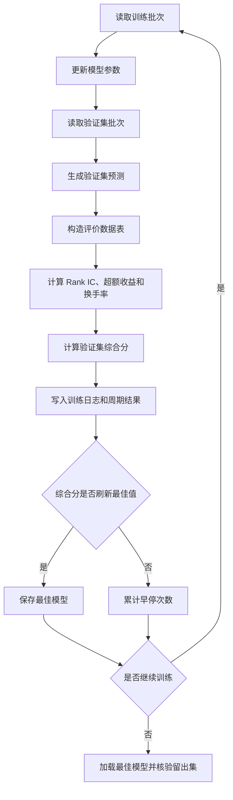

# 第二步：按比赛综合分验证的完整技术方案

## 1. 方案定位

本方案用于完成第一次 LST-Transformer 实验后的第二步优化：

```text
训练每一个周期
→ 在验证集生成预测
→ 按比赛规则计算完整指标
→ 计算验证集综合分
→ 按综合分选择最佳模型
→ 固定模型和后处理参数
→ 在本地留出集进行最终核验
```

方案的核心任务是让模型选择标准与比赛评分规则一致。时间平滑、持有缓冲和时间稳定性损失属于后续换手率优化环节，本方案将时间平滑作为可接入的后处理实验，同时保留原始预测结果作为基准。

## 2. 当前代码与问题

### 2.1 当前训练流程

[train_first_lstm_transformer.py](E:/ChatGPT/ChatGPT_Project/深圳金融比赛赛题五/模型训练/train_first_lstm_transformer.py) 当前每轮训练后会：

1. 使用训练集更新模型参数；
2. 使用验证集计算验证损失；
3. 计算验证集日度 Rank IC；
4. 按验证集 Rank IC 保存最佳模型；
5. 训练完成后使用最佳模型评估本地留出集。

当前模型选择逻辑相当于：

```python
metric = validation_result['daily_rank_ic_mean']
```

### 2.2 当前评价流程

[evaluate_first_lstm_result.py](E:/ChatGPT/ChatGPT_Project/深圳金融比赛赛题五/模型训练/evaluate_first_lstm_result.py) 已经能够对本地留出集计算：

- 日度 Rank IC；
- ICIR；
- 正 IC 交易日比例；
- Top10% 年化超额收益；
- 平均换手率；
- 综合分。

当前完整评价主要发生在训练结束之后，训练周期选择仍然依据 Rank IC。

### 2.3 需要解决的问题

比赛综合分同时评价股票排序、Top10% 组合收益和组合换手率。单独使用 Rank IC 选择训练周期，可能保留一个排序能力较强但换手率较高的模型。

本方案需要把完整评价流程移到每个训练周期的验证阶段，并用验证集综合分决定最佳模型。

### 2.4 当前必须修改

本轮代码修改按以下顺序完成：

1. 将赛题提供的 `evaluate.py` 作为指标计算的主规则来源；
2. 为赛题评价逻辑增加 `evaluate_frame(frame)` 和
   `evaluate_parquet(prediction_path, evaluation_data)` 接口；
3. 使用 Parquet 保存每个训练周期的预测结果，避免训练期间反复生成 CSV；
4. 保留 `evaluate.py` 的 CSV 入口，用于最终完整 `submission.csv` 评价；
5. 使用赛题规则统一实现 Rank IC、Top1 取样、Top10% 超额收益和换手率；
6. 修正本地评价函数中 Rank IC 缺失收益过滤与换手率样本规则；
7. 在每个训练周期生成完整评价表并记录全部比赛指标；
8. 保留实验组 A 的 Rank IC 选模流程，新增实验组 B 的综合分选模和早停流程；
9. 增加预测键、样本覆盖、重复键、有限值和官方提交文件完整性检查；
10. 使用最终固定预测文件运行 `evaluate.R`，完成 Python 结果的独立复核。

当前阶段只完成评价口径、Parquet 评价接口、实验组 A、实验组 B 和提交完整性检查，
先确认综合分评价链路能够稳定运行。最终模型确定后才把完整预测结果导出为 CSV。

### 2.5 后续计划修改

当前评价链路和实验组 A、B 核验完成后，再进行以下修改：

1. 增加每只股票按交易日期维护历史状态的时间平滑模块；
2. 在验证集测试 `α = 1.0、0.9、0.7、0.5、0.3`；
3. 固定实验组 B 的最佳模型，依据验证集综合分选择平滑参数；
4. 在本地留出集评估实验组 C，并使用 Python 和 R 交叉核对结果；
5. 本方案完成后，再实施持有缓冲、时间稳定性损失、Pairwise Ranking Loss、滚动验证、
   因子窗口消融和模型融合。

## 3. 实验目标与假设

### 3.1 实验目标

实验需要得到以下结果：

1. 每一个训练周期都有完整的比赛指标；
2. 能够按照验证集综合分保存最佳模型；
3. 能够比较 Rank IC 选模和综合分选模的差异；
4. 能够验证预测平滑对换手率和综合分的影响；
5. 使用本地留出集检验最终配置的时间外泛化表现。

### 3.2 实验假设

#### 假设一：综合分选模更符合比赛目标

如果某个训练周期的 Rank IC 略低，但 Top10% 超额收益更稳定、换手率更低，那么该周期可能获得更高综合分。

#### 假设二：时间平滑可以降低换手率

对同一股票相邻交易日的预测分数进行平滑，能够减少预测分数的短期跳动，从而减少 Top10% 股票集合的变化。

#### 假设三：平滑强度存在取舍

平滑过强可能降低换手率，但也可能削弱模型对短期信息的反应，使 Rank IC 或 Top10% 超额收益下降。因此参数必须由验证集综合分选择。

## 4. 数据职责和时间边界

| 数据集 | 作用 | 是否参与参数选择 |
|---|---|---|
| `train_fit` | 更新模型参数 | 是，用于训练 |
| `validation` | 选择训练周期、评价平滑参数 | 是 |
| `local_holdout` | 检查最终泛化表现 | 否 |
| `competition_test` | 生成最终提交预测 | 模型冻结后使用 |

本地留出集对应当前项目的 2024 年本地留出时期。训练周期、平滑参数、持有规则等所有选择都完成后，才使用本地留出集进行一次最终配置核验。

## 5. 比赛指标定义

### 5.1 综合分公式

项目当前采用的综合分为：

```text
综合分
= 日度 Rank IC 均值 × 0.4
+ Top10% 年化超额收益 × 0.3
+ (1 - 平均换手率) × 0.3
```

### 5.2 日度 Rank IC

对每个交易日单独计算预测值和 `y_ret_1d` 的 Spearman 相关系数：

```text
删除 y_ret_1d 缺失样本
当天有效样本数少于 30 时跳过当天
→ 计算当天预测排名与收益排名的相关性
→ 对所有有效交易日的 IC 求平均
```

Rank IC 不根据 `flag_limit_up` 过滤样本。

Rank IC 评价股票排序能力。它不表示模型预测收益率的百分比。

### 5.3 ICIR

```text
ICIR = Rank IC 均值 / Rank IC 标准差
```

标准差使用有效交易日 IC 的样本标准差。ICIR 用作稳定性辅助指标，不直接进入当前综合分公式。

### 5.4 正 IC 交易日比例

```text
正 IC 交易日比例
= Rank IC 大于 0 的交易日数量 / 有效交易日数量
```

它用于观察模型在多少交易日保持正向排序能力。

### 5.5 Top10% 年化超额收益

每个交易日执行：

1. 剔除涨停股票；
2. 剔除 `y_ret_1d` 缺失样本；
3. 有效股票数量少于 100 时跳过当天；
4. 按预测值降序排列；
5. 计算 `top_count = max(len(valid) // 10, 1)`，取前 `top_count` 只股票作为 Top1 组；
6. 计算 Top10% 平均收益减去全部有效股票平均收益；
7. 对日均超额收益乘以 252。

```text
年化超额收益
= 所有有效交易日的平均日超额收益 × 252
```

### 5.6 平均换手率

对每天的 Top1 股票集合进行相邻日期比较。换手率样本只剔除涨停股票，保留
`y_ret_1d` 缺失但具有预测值的股票：

```python
valid = group[group['flag_limit_up'] == 0]
top_count = max(len(valid) // 10, 1)
current = set(valid.sort_values('pred', ascending=False).iloc[:top_count]['ts_code'])
```

当日有效股票少于 100 时，跳过当日换手率计算并重置前一持仓集合：

```python
if len(valid) < 100:
    previous = None
    continue
```

下一个有效交易日从空的前一持仓集合开始，不能跨越无效日期计算换手率。

对其他有效日期的 Top1 股票集合进行相邻日期比较：

```text
换手率_t
= 1 - |当前持仓集合 ∩ 前一交易日持仓集合|
      / |当前持仓集合 ∪ 前一交易日持仓集合|
```

当某个交易日有效股票少于 100 时，跳过该日，并重置上一持仓集合，避免跨越缺少有效组合的日期计算换手率。

### 5.7 指标过滤规则

Rank IC、Top10% 收益和换手率必须分别使用官方评测脚本的有效样本规则。原始预测、
平滑预测和不同实验组使用相同的规则：

| 指标 | 有效样本规则 |
|---|---|
| Rank IC | `y_ret_1d` 非缺失；少于 30 个样本时跳过日期；不筛选涨停标记 |
| Top10% 年化超额收益 | `flag_limit_up == 0` 且 `y_ret_1d` 非缺失；少于 100 个样本时跳过日期 |
| 平均换手率 | `flag_limit_up == 0`；少于 100 个样本时跳过日期并重置前一持仓集合 |

换手率计算中不得因为 `y_ret_1d` 缺失而删除股票。

## 6. 评价数据构造

### 6.1 验证集预测来源

`SequenceInputReader` 会返回：

```text
ts_code
target_date
y_ret_1d
x
```

模型输出后，将 `target_date` 命名为评价表中的 `trade_date`，将模型输出命名为 `pred`。

训练周期和本地留出集的预测结果优先保存为 Parquet。Parquet 评价表至少包含：

```text
ts_code
trade_date
pred
y_ret_1d
limit_up
prediction_eligible
```

`prediction_eligible` 用于追踪序列输入资格和检查数据覆盖，三类指标按照第 5.7 节分别
筛选样本。

### 6.2 涨停字段来源

验证集序列索引：

```text
模型预处理/步骤6_序列构造/序列索引_validation.parquet
```

验证集标准化数据：

```text
模型预处理/步骤5_标准化处理/验证集_标准化.parquet
```

使用序列索引中的 `source_row_index`，读取标准化数据对应行的 `limit_up`。

最终评价表为：

```text
ts_code
trade_date
pred
y_ret_1d
limit_up
prediction_eligible
```

训练和验证序列接口只读取 `prediction_eligible == 1` 的样本。指标评价时不能把
`prediction_eligible == 1` 作为所有指标的统一额外筛选条件，必须先与原始目标日记录按
`ts_code + trade_date` 对齐，再按第 5.7 节分别计算三类指标。

换手率评价表必须保留所有具有预测值且 `flag_limit_up == 0` 的股票，即使其
`y_ret_1d` 缺失。

训练过程的评价路径为：

```text
预测 Parquet
→ evaluate_parquet()
→ evaluate_frame()
→ 记录训练周期指标
```

最终提交路径为：

```text
最终 Parquet 预测
→ 完整 submission.csv
→ evaluate.py 正式评价
→ evaluate.R 独立复核
```

官方测试集预测文件必须覆盖测试集中的每一个 `ts_code + trade_date` 记录。序列模型
无法生成某条测试记录的预测时，必须在提交前终止流程并修复预测覆盖问题，不能省略该记录。

### 6.3 行顺序检查

在评价前必须检查：

```text
预测行数 = 合格序列数量
预测股票代码 = 合格序列中的 ts_code
预测日期 = 合格序列中的 target_date
涨停标记 = source_row_index 对应的 limit_up
```

如果这些检查失败，直接停止评价，避免把股票或日期错配后得到错误分数。

官方提交前还必须检查：

```text
提交行数 = 测试集_X 行数
提交键集合 = 测试集_X 的 ts_code + trade_date 键集合
提交键无重复
提交股票代码集合与测试集一致
提交交易日期集合与测试集一致
```

## 7. 训练循环改造（当前必须修改）

### 7.1 每轮训练流程



### 7.2 验证函数输出

现有验证函数已经返回预测数组、真实收益、日期和股票代码。需要继续保留这些字段，并增加评价表构造与完整评分：

```text
validation_predictions
validation_targets
validation_dates
validation_ts_codes
validation_score
```

每一轮的模型输出应当只计算一次，原始预测、平滑预测和不同后处理都基于同一份预测数据计算。

当前阶段的 Parquet 评价接口使用以下结构：

```python
def evaluate_frame(frame):
    # 复用赛题 evaluate.py 的指标计算逻辑
    return metrics


def evaluate_parquet(prediction_path, evaluation_data):
    prediction = pd.read_parquet(prediction_path)
    frame = prediction.merge(
        evaluation_data,
        on=['ts_code', 'trade_date'],
        how='inner'
    )
    return evaluate_frame(frame)
```

`evaluate_frame` 只接收统一评价表并计算指标，`evaluate_parquet` 负责读取预测 Parquet、
按 `ts_code + trade_date` 对齐标签和涨停字段，并执行重复键、覆盖范围和有限值检查。
每个训练周期不生成 CSV。

### 7.3 训练日志字段

每一轮至少记录：

```text
epoch
train_loss
validation_loss
validation_rank_ic_mean
validation_rank_ic_std
validation_icir
validation_ic_positive_ratio
validation_annual_excess
validation_mean_turnover
validation_one_minus_turnover
validation_final_score
```

还应记录：

```text
validation_rank_ic_days
validation_top_decile_days
validation_turnover_transition_days
```

这些数量用于判断指标是否建立在足够的交易日上。

## 8. 模型选择和早停（当前必须修改）

本阶段的指标主规则来自赛题提供的
[evaluate.py](C:/Users/Lenovo/Desktop/2026深圳国际金融科技大赛/赛题五/evaluate.py)，
固定预测文件使用
[evaluate.R](C:/Users/Lenovo/Desktop/2026深圳国际金融科技大赛/赛题五/evaluate.R)
进行独立复核。项目内部评价函数只负责将验证集和本地留出集数据适配为统一评价表，
不重新定义比赛指标。训练期间使用 Parquet 评价接口，最终提交继续使用赛题原有的
CSV 入口。

### 8.1 实验组 A：Rank IC 选模

用于复现当前基准：

```text
最佳指标 = validation_rank_ic_mean
```

训练目标、批次大小、随机种子和模型结构均保持现有配置。

### 8.2 实验组 B：综合分选模

用于验证第二步核心改动：

```text
最佳指标 = validation_final_score
```

核心代码逻辑为：

```python
metric = validation_score['final_score']
```

当本轮 `metric` 大于历史最佳值时：

1. 更新最佳综合分；
2. 记录最佳训练周期；
3. 保存模型参数；
4. 重置早停计数。

当本轮综合分没有刷新最佳值时，早停计数加一。

### 8.3 早停规则

早停耐心值沿用当前配置中的 `early_stopping_patience`。每次比较使用同一个验证指标，实验组 A 使用 Rank IC，实验组 B 使用综合分。

训练结束后必须重新加载保存的最佳模型，不能直接使用最后一个训练周期的模型。

### 8.4 平分时的固定处理

如果两个周期的综合分相同，使用以下固定规则：

1. 平均换手率更低者优先；
2. Rank IC 更高者优先；
3. 训练周期更早者优先。

## 9. 实验组和控制变量

### 9.1 实验组设计

| 实验组 | 训练目标 | 训练周期选择 | 预测处理 | 用途 |
|---|---|---|---|---|
| A | Smooth L1 Loss | Rank IC 最高 | 原始预测 | 当前方法基准 |
| B | Smooth L1 Loss | 综合分最高 | 原始预测 | 验证综合分选模 |
| C | Smooth L1 Loss | 综合分最高 | 时间平滑预测 | 后续验证换手率后处理 |

### 9.2 控制变量

实验组 A 和 B 必须保持以下内容一致：

- 训练集和验证集文件；
- 特征字段；
- 缺失值处理；
- 标准化参数；
- 模型结构；
- 批次大小；
- 学习率；
- 权重衰减；
- 梯度裁剪；
- 随机种子；
- 训练周期上限；
- 评价样本过滤规则。

实验组 B 和 C 只改变预测信号处理方式，其他内容保持一致。

## 10. 时间平滑后处理（后续计划修改）

### 10.1 平滑公式

对每只股票按交易日期顺序维护历史状态：

```text
s_t = α × p_t + (1 - α) × s_(t-1)
```

股票第一次出现时：

```text
s_t = p_t
```

平滑后的 `s_t` 用于当天的股票排序。

### 10.2 参数范围

验证集测试：

```text
α = 1.0、0.9、0.7、0.5、0.3
```

其中 `α = 1.0` 是无平滑基准。

### 10.3 参数选择

对每个参数计算：

```text
Rank IC
ICIR
正 IC 交易日比例
Top10% 年化超额收益
平均换手率
综合分
```

选择验证集综合分最高的参数。参数确定后，再应用于本地留出集。

### 10.4 状态边界

验证集和本地留出集开始时没有此前的模型预测状态，第一条记录使用原始预测初始化。正式测试阶段如果需要连续状态，应使用同一冻结模型生成连续历史预测，并按交易日期传递状态。

## 11. 本地留出集核验

### 11.1 核验顺序

实验组 B 的原始预测核验属于当前阶段，实验组 C 的平滑预测核验属于后续阶段。

完成验证集模型选择后，固定：

```text
最佳训练周期
最佳模型参数
最佳平滑参数
评价程序版本
```

然后：

1. 加载最佳模型；
2. 生成本地留出集原始预测；
3. 按固定规则生成平滑预测；
4. 使用统一评价函数计算全部指标；
5. 保存原始预测和平滑预测的结果；
6. 与实验组 A 的历史基准进行比较。

### 11.2 核验结果

本地留出集报告至少包含：

```text
样本数量
交易日数量
Rank IC 均值
ICIR
正 IC 交易日比例
Top10% 年化超额收益
平均换手率
1 - 平均换手率
综合分
```

## 12. 结果判定

### 12.1 主要指标

主要指标是本地留出集综合分。

实验组 B 的综合分高于实验组 A，说明综合分选模提高了模型选择与比赛目标的一致性。

实验组 C 的综合分高于实验组 B，且换手率下降，说明时间平滑对当前模型具有实际帮助。

### 12.2 辅助指标

同时检查：

- Rank IC 是否保持为正；
- Top10% 年化超额收益是否保持为正；
- ICIR 是否出现明显下降；
- 正 IC 交易日比例是否明显下降；
- 验证集到本地留出集的综合分差距；
- 各季度换手率是否持续下降。

### 12.3 结果解释表

| 结果 | 解释 |
|---|---|
| 综合分提高，换手率下降 | 综合目标和交易稳定性同时改善 |
| 综合分提高，换手率上升 | 收益部分的提升抵消了换手率成本 |
| 综合分下降，换手率下降 | 平滑可能削弱了排序和收益能力 |
| 验证集提高，本地留出集下降 | 配置可能适应了验证时期的特征 |
| 验证集和留出集都下降 | 当前改变不适合现有模型或数据口径 |

## 13. 输出文件

建议生成：

```text
模型训练/第二次综合分验证实验/
├─ 运行配置.json
├─ 训练日志.csv
├─ 验证集各周期比赛指标.csv
├─ 验证集平滑参数比较.csv
├─ checkpoint_epoch_XX.pt
├─ 最佳模型_按综合分.pt
├─ validation_predictions_epoch_XX.parquet
├─ validation_evaluation_epoch_XX.parquet
├─ 本地留出集原始预测.parquet
├─ 本地留出集平滑预测.parquet
├─ 本地留出集比赛指标评估.json
├─ 最终submission.csv
└─ 实验报告.md
```

训练周期和本地留出集评价优先保存为 Parquet。`最终submission.csv` 只在模型和参数
全部固定后生成，用于运行赛题 `evaluate.py` 和 `evaluate.R`。

`验证集各周期比赛指标.csv` 至少包含：

```text
epoch
validation_rank_ic_mean
validation_icir
validation_annual_excess
validation_mean_turnover
validation_final_score
```

`验证集平滑参数比较.csv` 至少包含：

```text
epoch
alpha
rank_ic_mean
icir
annual_excess
mean_turnover
final_score
```

## 14. 验证和检查

### 14.1 评价函数核对

使用现有本地留出集预测重新运行统一评价函数，确认 Rank IC、Top10% 年化超额收益、
平均换手率和综合分均能正常生成。换手率规则已经按照官方脚本调整，原有评价结果不能
直接作为新的验收数值；应以更新后的评价函数重新生成
`本地留出集比赛指标评估.json`，并将实际结果写入实验报告。

### 14.2 数据一致性检查

- 预测行数与合格序列数量一致；
- 预测日期与 `target_date` 一致；
- 预测股票代码与序列索引一致；
- `limit_up` 能通过 `source_row_index` 正确对应；
- Parquet 评价文件包含 `ts_code`、`trade_date`、`pred`、`y_ret_1d`、`limit_up` 和
  `prediction_eligible` 字段；
- Parquet 文件中的 `ts_code + trade_date` 键不存在重复；
- 每个交易日排序前没有重复股票；
- 评价中的预测值和 `limit_up` 都是有限数值；Rank IC 和 Top10% 收益计算前已删除
  `y_ret_1d` 缺失样本，换手率保留这些样本。
- 换手率未删除 `y_ret_1d` 缺失样本；
- 有效股票少于 100 的日期已重置前一持仓集合；
- Top1 股票数量使用 `max(len(valid) // 10, 1)`；
- 官方提交文件覆盖测试集全部 `ts_code + trade_date` 记录；
- 官方提交文件不存在重复键，股票代码集合和交易日期集合与测试集一致。
- 最终 `submission.csv` 只在模型和参数固定后生成，并通过赛题 Python 和 R 程序复核。

### 14.3 时间泄漏检查

- 训练批次只使用训练集数据；
- 验证指标只使用当前周期的验证预测和验证标签；
- 平滑只使用当前及历史预测；
- 本地留出集不参与周期、参数或规则选择；
- 正式测试预测按交易日期顺序生成。

## 15. 完成标准

### 15.1 当前阶段完成标准

1. 每个训练周期都有完整比赛指标；
2. 综合分可以直接作为最佳模型选择指标；
3. 早停与模型保存使用同一个验证指标；
4. 实验组 A 和 B 的控制变量保持一致；
5. 赛题 Python 评价程序已接入内存评价表，原有提交文件入口保持可用；
6. `evaluate.R` 已经能够对固定预测文件进行独立复核；
7. 每轮训练预测和评价表以 Parquet 保存，不在训练周期内生成 CSV；
8. 换手率严格执行涨停过滤、100 个有效股票阈值和前一持仓集合重置规则；
9. 官方测试集预测文件覆盖全部测试记录并通过完整性检查；
10. 当前阶段报告同时展示排序能力、组合收益、换手率和综合分；
11. 最终模型和参数固定后生成完整 `submission.csv`。

### 15.2 后续阶段完成标准

1. 时间平滑参数只通过验证集确定；
2. 本地留出集只用于最终核验；
3. 实验组 C 使用冻结模型和固定平滑参数完成本地留出集评价；
4. Python 和 R 对实验组 C 的固定预测文件完成交叉核对；
5. 报告能够区分模型选择标准和预测后处理各自带来的指标变化；
6. 后续持有缓冲、时间稳定性损失、Pairwise Ranking Loss、滚动验证、因子窗口消融和
   模型融合均基于当前统一评价链路实施。

## 16. 当前实验的边界

本方案完成后，才进入后续实验：

- 持有缓冲规则；
- 时间稳定性训练损失；
- Pairwise Ranking Loss；
- 滚动验证和季度稳定性分析；
- 因子组合与历史窗口消融；
- LST-Transformer 与 LightGBM 融合。

这些方法使用本方案建立的统一评价流程进行比较。
